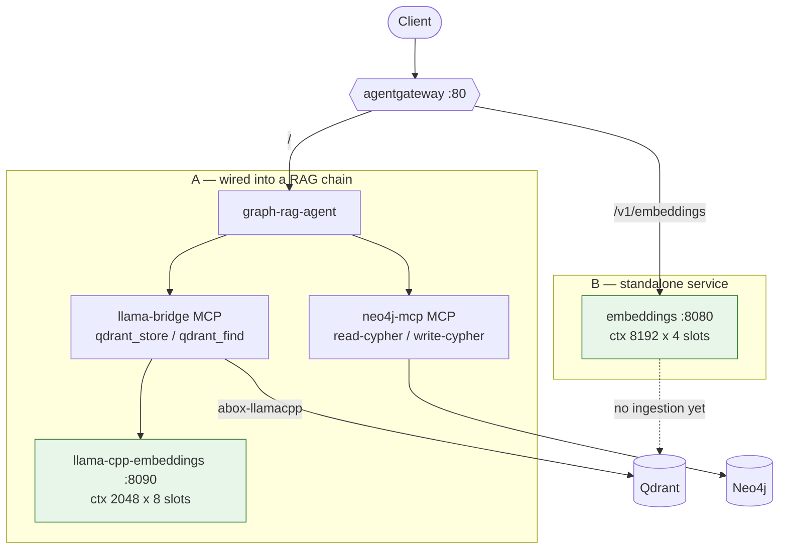

# Embedding runtime: context length against concurrency

- **Type:** research note, not a decision
- **Date:** 2026-09-14
- **Related:** [ADR-0001](./adr/0001-text-embedding-model.md), [ADR-0002](./adr/0002-embedding-runtime-in-cluster.md)

Two independent deployments of the same embedding model happen to run side by side in this
cluster, configured differently. Comparing them isolates a trade-off that is easy to get
wrong without noticing, because neither wrong answer produces an error.

## The mechanism

Two `llama-server` flags interact, and only their product is visible in the logs:

1. `--ctx-size` is divided across `--parallel` slots. Eight slots over 16384 gives 2048 per
   request, not 16384.
2. Each slot is then capped at `n_ctx_train / rope_freq_scale`, where `n_ctx_train` comes
   from the GGUF.

For `nomic-embed-text-v1.5` the GGUF reports `n_ctx_train = 2048`. The 8192-token context
the model is known for is reached by RoPE scaling, so without `--rope-freq-scale` you get
2048 regardless of what `--ctx-size` says. With the `0.75` printed on the model card you get
`2048 / 0.75 = 2730`, and the server says so once at startup and then carries on:

```
srv load_model: the slot context (8192) exceeds the training context of the model (2730) - capping
```

`0.25` yields the full 8192.

The failure mode is silence. A capped context truncates documents at index time; retrieval
then underperforms for reasons that show up nowhere in the logs.

## Two live configurations

Both run `nomic-embed-text-v1.5` at `Q8_0`. Confirmed identical from server metadata:
`n_params` 136,727,040, `n_embd` 768, `n_ctx_train` 2048, `n_vocab` 30522 (BERT), file size
145,389,792 bytes.

| | A — `llama-cpp-embeddings` | B — `embeddings` |
|---|---|---|
| `--ctx-size` | 16384 | 8192 |
| `--parallel` | 8 | 4 (default) |
| Context per request | **2048** | **8192** |
| Concurrent requests | **8** | 4 |
| RoPE scaling | not set | `yarn`, `0.25` |
| Pooling | inferred from GGUF | explicit `mean` |
| Image | floating `:server` tag | pinned by digest |
| Exposure | ClusterIP only | HTTPRoute on the gateway |

A favours throughput, B favours document length. Neither is wrong; they answer different
questions. What makes the comparison worth writing down is that the axis is invisible unless
you go looking — A's configuration is internally consistent and logs no warning at all.

## How they are wired



Green marks the two model servers — the same model, differently tuned. The second axis the
diagram shows is integration: A is consumed by an agent through MCP tools, B is reachable
but has no caller. A longer context is worth nothing until something indexes with it.

## Measurements

Taken on B, CPU-only, against the semantic pair in the
[verification suite](./todo/embeddings-verification.md):

| `--rope-freq-scale` | Context per slot | Related | Unrelated | Margin |
|---|---|---|---|---|
| `0.75` (model card) | 2730 | 0.8417 | 0.4821 | 0.3596 |
| `0.25` | 8192 | 0.8209 | 0.4379 | **0.3829** |

Extending the context did not cost short-text quality — the margin widened slightly. Inputs
of 3520 and 5934 tokens embedded cleanly at `0.25` and would have been truncated at `0.75`.

Truncating the 768-dim vector to 256 and re-normalizing held the ranking: 0.8330 against
0.4293, margin 0.4036. Matryoshka behaves as ADR-0001 assumes.

## Choosing between them

Chunk size decides, not preference.

- **Chunks below ~2000 tokens** — the extra context buys nothing. Take the slots: more
  concurrency is real throughput during ingestion.
- **Whole documents or long sections** — extend the context, and size `--ctx-size` as
  `slots × 8192`. Eight slots at full context needs `--ctx-size 65536`, which is a real KV
  cache cost on a 2-core sandbox. Fewer slots is usually the better trade.
- **Unsure** — measure the token length distribution of your corpus first. The answer is a
  property of the data.

Whichever you pick, set `--rope-freq-scale` explicitly. Leaving it out silently selects
2048, and that reads as a deliberate choice in the manifest when it is not one.

## What this does not settle

Retrieval quality on a real corpus. Every number here comes from one sentence pair, which
detects a broken configuration and nothing more. ADR-0001 requires a gold-standard benchmark
on the target corpus before any of this reaches users, and that requirement is unaffected by
anything on this page.
